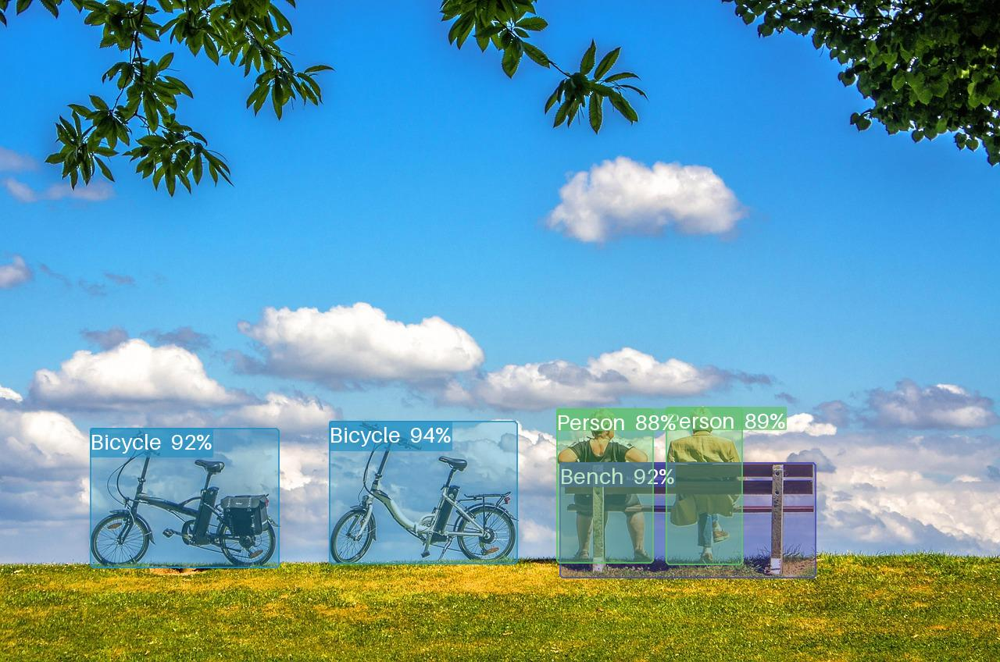
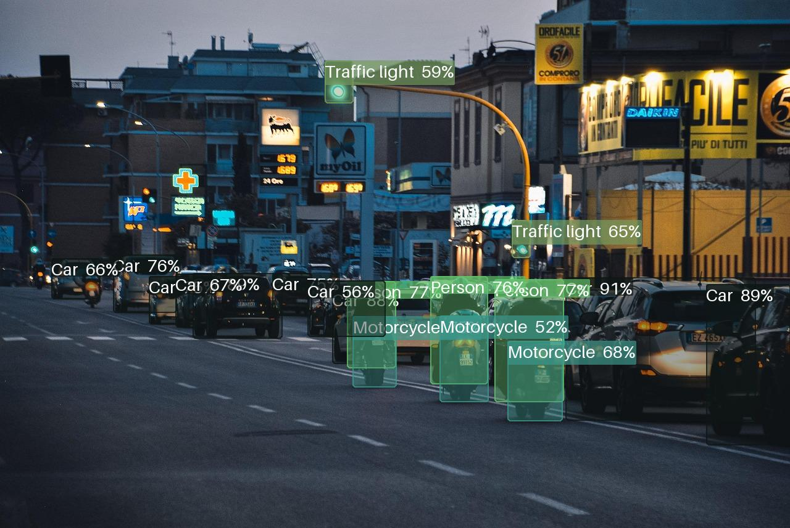

# YOLO: YOLOv9, YOLOv7, YOLO-RD

[](https://shreyaskamathkm.github.io/yolo/)


[](https://github.com/shreyaskamathkm/yolo/actions/workflows/integration.yaml)
[](https://github.com/shreyaskamathkm/yolo/actions/workflows/docker.yaml)
[](https://github.com/shreyaskamathkm/yolo/actions/workflows/release.yaml)

A community-maintained, batteries-included fork of [MultimediaTechLab/YOLO](https://github.com/MultimediaTechLab/YOLO) with a cleaner codebase, one-command setup, full documentation, and active bug fixes — making YOLOv9, YOLOv7, and YOLO-RD easier to use in practice.


## What This Fork Adds

This fork builds on the excellent foundation of [MultimediaTechLab/YOLO](https://github.com/MultimediaTechLab/YOLO)
with additional tooling, documentation, and fixes focused on practical usability:

| Feature | Details |
|---|---|
| 🛠️ One-command setup | `make setup` auto-creates a venv, installs dependencies, and configures pre-commit hooks |
| 📖 Full documentation site | MkDocs site with tutorials, API reference, custom model guides, and deployment walkthroughs |
| 🐛 Bug fixes | Addresses several open issues from the upstream tracker |
| 🧹 Cleaner codebase | Refactored for readability and long-term maintainability |
| 🚀 Versioned releases | 12 tagged releases (v0.1 → v0.4.0) with changelogs |
| ⚙️ CI/CD pipeline | Integration tests, Docker publish, and automated release workflows |
## TL;DR

This is an MIT-licensed YOLO implementation. Install and run in two commands:

```shell
pip install git+https://github.com/shreyaskamathkm/yolo.git
```

## Introduction

This repository implements three YOLO variants:

- [**YOLOv9**: Learning What You Want to Learn Using Programmable Gradient Information](https://arxiv.org/abs/2402.13616)
- [**YOLOv7**: Trainable Bag-of-Freebies Sets New State-of-the-Art for Real-Time Object Detectors](https://arxiv.org/abs/2207.02696)
- [**YOLO-RD**: Introducing Relevant and Compact Explicit Knowledge to YOLO by Retriever-Dictionary](https://arxiv.org/abs/2410.15346)

## Installation

Clone the repo and run:

```shell
git clone git@github.com:shreyaskamathkm/yolo.git
cd yolo
make setup
```

This automatically creates a `.venv` virtual environment, installs all dependencies, and sets up pre-commit hooks. To customize:

```shell
make setup VENV=myenv PYTHON=python3.11
```

> **Full installation guide**: [Get Started →](https://shreyaskamathkm.github.io/yolo/0_get_start/0_quick_start/)

## Usage

For full examples and customization, see the [Notebooks](examples) and [HOWTO guide](docs/HOWTO.md).

### Training

1. Point the dataset config to your data:
```shell
# Edit yolo/config/dataset/**.yaml with your dataset path
```
2. Run training:
```shell
python yolo/lazy.py task=train dataset=** use_wandb=True
python yolo/lazy.py task=train task.data.batch_size=8 model=v9-c weight=False
```

### Transfer Learning

```shell
python yolo/lazy.py task=train task.data.batch_size=8 model=v9-c dataset={dataset_config} device={cpu,mps,cuda}
```

### Inference

```shell
# If cloned from GitHub
python yolo/lazy.py task=inference \
    name=AnyNameYouWant \
    device=cpu \
    model=v9-s \
    task.nms.min_confidence=0.1 \
    task.fast_inference=onnx \
    task.data.source=data/toy/images/train \
    +quiet=True

# If pip installed
yolo task.data.source={Any Source}
yolo task=inference task.data.source={Any}
```

### Validation

```shell
python yolo/lazy.py task=validation
python yolo/lazy.py task=validation dataset=toy
```

## Inference Results

| Input | Detection Output |
|---|---|
|  | Detected: person, bicycle, bench |
|  | Detected: person, car, motorcycle, traffic light |

<sub>Sample images from [Pixabay](https://pixabay.com) (CC0 license).</sub>

## Documentation

The full documentation site covers everything from quick start to custom model architecture:

- [Quick Start](https://shreyaskamathkm.github.io/yolo/0_get_start/0_quick_start/)
- [Tutorials](https://shreyaskamathkm.github.io/yolo/1_tutorials/0_allIn1/)
- [Custom YOLO (model, augmentation, loss)](https://shreyaskamathkm.github.io/yolo/3_custom/0_model/)
- [Deployment Guide](https://shreyaskamathkm.github.io/yolo/4_deploy/1_deploy/)
- [API Reference](https://shreyaskamathkm.github.io/yolo/6_function_docs/0_model/)

## Contributing

Contributions are welcome — bug reports, feature requests, and pull requests alike. See [CONTRIBUTING](docs/CONTRIBUTING.md) for guidelines.

## Maintainer

**Shreyas Kamath** — Senior Computer Vision Engineer at SimpliSafe, PhD in Computer Vision with 20+ publications and 5 patents. Research focus: thermal imaging, semantic segmentation, cross-modal recognition, and edge deployment.

- 🔗 [GitHub](https://github.com/shreyaskamathkm)
- 📄 [Google Scholar](https://scholar.google.com/citations?user=dMTASX8AAAAJ)
- 💼 [LinkedIn](https://www.linkedin.com/in/shreyaskamath/)

## Roadmap

- [ ] End-to-end COCO training validation
- [ ] MLflow integration
- [ ] YOLOv9-E model support
- [ ] DDP (Distributed Data Parallel) support
- [ ] Refactor utils into modular subfolders
- [ ] Thermal dataset examples (FLIR, KAIST)

## Acknowledgments

This project is a fork of [MultimediaTechLab/YOLO](https://github.com/MultimediaTechLab/YOLO). Many thanks to the MultimediaTechLab team and the original authors of YOLOv7, YOLOv9, and YOLO-RD for their foundational work.

## Citations

```bibtex
@inproceedings{wang2022yolov7,
    title={{YOLOv7}: Trainable Bag-of-Freebies Sets New State-of-the-Art for Real-Time Object Detectors},
    author={Wang, Chien-Yao and Bochkovskiy, Alexey and Liao, Hong-Yuan Mark},
    year={2023},
    booktitle={Proceedings of the IEEE/CVF Conference on Computer Vision and Pattern Recognition (CVPR)},
}
@inproceedings{wang2024yolov9,
    title={{YOLOv9}: Learning What You Want to Learn Using Programmable Gradient Information},
    author={Wang, Chien-Yao and Yeh, I-Hau and Liao, Hong-Yuan Mark},
    year={2024},
    booktitle={Proceedings of the European Conference on Computer Vision (ECCV)},
}
@inproceedings{tsui2024yolord,
    author={Tsui, Hao-Tang and Wang, Chien-Yao and Liao, Hong-Yuan Mark},
    title={{YOLO-RD}: Introducing Relevant and Compact Explicit Knowledge to YOLO by Retriever-Dictionary},
    booktitle={Proceedings of the International Conference on Learning Representations (ICLR)},
    year={2025},
}
```

[^1]: [**YOLOv7**: Trainable Bag-of-Freebies Sets New State-of-the-Art for Real-Time Object Detectors](https://arxiv.org/abs/2207.02696)

[^2]: [**YOLOv9**: Learning What You Want to Learn Using Programmable Gradient Information](https://arxiv.org/abs/2402.13616)

[^3]: [**YOLO-RD**: Introducing Relevant and Compact Explicit Knowledge to YOLO by Retriever-Dictionary](https://arxiv.org/abs/2410.15346)
