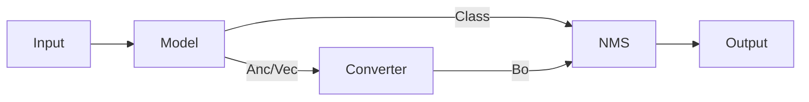

# Build Model

In YOLOv7, predictions are `Anchor`-based. In YOLOv9, predictions are `Vector`-based. A converter transforms bounding boxes to the appropriate format.



## Load Model

Use `create_model` to automatically create the `YOLO` model and load weights.

| Argument | Type | Description |
|---|---|---|
| `model` | `ModelConfig` | The model configuration |
| `class_num` | `int` | Number of dataset classes, used for the prediction head |
| `weight_path` | `Path \| bool` | `False` = no weights; `True`/`None` = default weights; `Path` = load from path |

```python
model = create_model(cfg.model, class_num=cfg.dataset.class_num, weight_path=cfg.weight)
model = model.to(device)
```

## Deploy Model

Optimizes the model for inference by stripping auxiliary branches and loading it into a specialized backend (Torch, ONNX, or TensorRT).

```python
from yolo.deploy.factory import create_inference_backend

backend = create_inference_backend(cfg.task.backend, cfg.weight, device, cfg)
```

## Autoload Converter

Autoloads the converter based on model type (`v7` → `Anc2Box`, `v9` → `Vec2Box`). The converter transforms raw model outputs into bounding boxes.

| Argument | Description |
|---|---|
| `model_name` | Name of the model (selects `Vec2Box` or `Anc2Box`) |
| `model` | The model instance used for auto-detecting the anchor grid |
| `anchor_cfg` | Anchor configuration for generating the grid |
| `image_size` | The input image resolution `[H, W]` |
| `device` | Computing device |
| `class_num` | Number of classes (required for `Anc2Box`) |

```python
from yolo.tasks.detection.postprocess import create_converter

converter = create_converter(
    cfg.model.name,
    model,
    cfg.model.anchor,
    cfg.image_size,
    device,
    class_num=cfg.dataset.class_num
)
```
