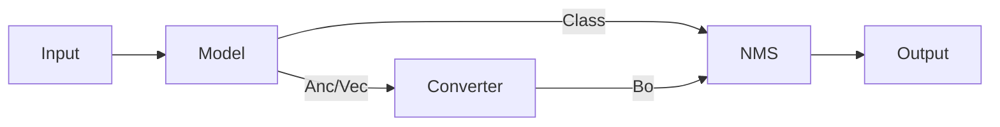

# Build Model

In YOLOv7, predictions are `Anchor`-based. In YOLOv9, predictions are `Vector`-based. A converter transforms bounding boxes to the appropriate format.



## Load Model

Use `create_model` to automatically create the `YOLO` model and load weights.

| Argument | Type | Description |
|---|---|---|
| `model` | `ModelConfig` | The model configuration |
| `class_num` | `int` | Number of dataset classes, used for the prediction head |
| `weight_path` | `Path \| bool` | `False` = no weights; `True`/`None` = default weights; `Path` = load from path |

```python
model = create_model(cfg.model, class_num=cfg.dataset.class_num, weight_path=cfg.weight)
model = model.to(device)
```

## Deploy Model

Removes the auxiliary branch for fast inference. Loads/compiles to ONNX or TensorRT if configured.

```python
model = FastModelLoader(cfg).load_model(device)
```

## Autoload Converter

Autoloads the converter based on model type (`v7` → `Anc2Box`, `v9` → `Vec2Box`).

| Argument | Type | Description |
|---|---|---|
| Model Name | `str` | Selects `Vec2Box` or `Anc2Box` |
| Anchor Config | — | Anchor configuration for generating the anchor grid |
| `model`, `image_size` | — | Used for auto-detecting the anchor grid |

```python
converter = create_converter(cfg.model.name, model, cfg.model.anchor, cfg.image_size, device)
```
