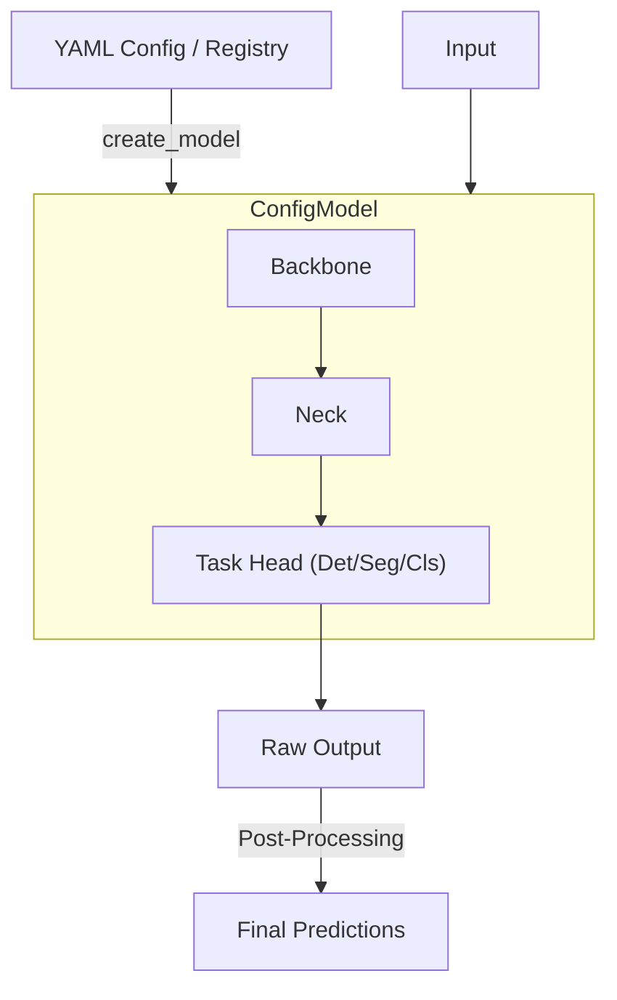

# Build Model

The model architecture is task-agnostic and configuration-driven. The system uses a registry-based approach to build models from YAML definitions or custom classes.


```mermaid
flowchart TD
    Config["YAML Config / Registry"] -- create_model --> Model
    Input --> Model
    subgraph Model [ConfigModel]
        Backbone --> Neck
        Neck --> Head["Task Head (Det/Seg/Cls)"]
    end
    Head --> Output["Raw Output"]
    Output -- Post-Processing --> Final["Final Predictions"]
```

## Load Model

Use `create_model` to instantiate the model and load weights. This factory function handles registry lookup, weight downloading/loading, and optional `torch.compile` optimization.

| Argument | Type | Description |
|---|---|---|
| `model_cfg` | `ModelConfig` | The model architecture configuration |
| `weight_path` | `Path \| bool` | `False` = no weights; `True` = default weights (`weights/<name>.pt`); `Path` = load from path |
| `class_num` | `int` | Number of dataset classes |
| `weight_key` | `str` | Key in the weight dictionary to load from (default: `state_dict`) |
| `strict` | `bool` | If `True`, fails if weights are not 100% matched |

```python
from yolo.model.builder import create_model

model = create_model(
    cfg.model,
    class_num=cfg.dataset.class_num,
    weight_path=cfg.weight,
    strict=True
)
model = model.to(device)
```

## ConfigModel

The default `ConfigModel` assembles layers sequentially based on the `model` section of the configuration. It automatically injects metadata like `num_classes` and `reg_max` into the layers that require them.

## Torch Compile

You can enable `torch.compile` directly in the model configuration. This can significantly speed up training and inference on supported hardware.

```yaml
model:
  compile:
    enabled: true
    backend: inductor  # default
    mode: default      # default
```

When enabled, the model is wrapped in an `OptimizedModule`. The system's internal utilities (like `unwrap_model`) ensure that features like EMA and weight loading continue to work correctly.

## Deploy Model

Optimizes the model for inference by stripping auxiliary branches and loading it into a specialized backend (Torch, ONNX, or TensorRT).

```python
from yolo.deploy.factory import create_inference_backend

backend = create_inference_backend(cfg.task.backend, cfg.weight, device, cfg)
```

## Task-Specific Heads

The model supports various task-specific heads registered in the `BLOCKS` registry:
- **Detection**: `MultiheadDetection`, `Detection`, `IDetection`
- **Segmentation**: `MultiheadSegmentation`, `Segmentation`
- **Classification**: `Classification`
