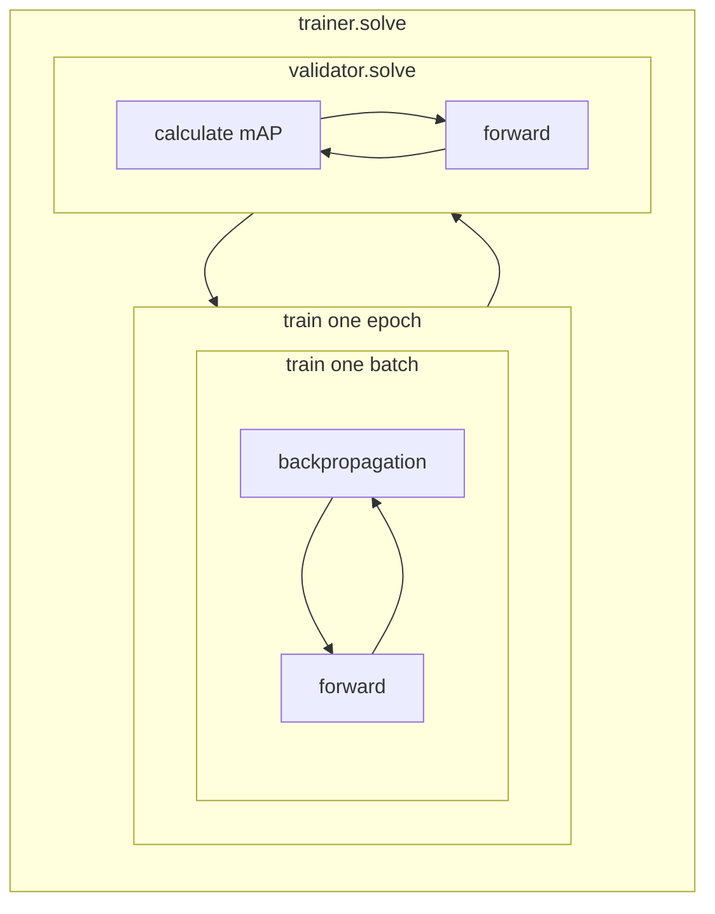

# Train & Validate

## Training Model

`ModelTrainer` manages the training process. Initialize it and call `solve` to start training. Start the progress logger before training to enable logging, W&B, or TensorBoard.

```python
from yolo import ModelTrainer
solver = ModelTrainer(cfg, model, converter, progress, device, use_ddp)
progress.start()
solver.solve(dataloader)
```

### Training Diagram



## Training Callbacks

### Gradient Accumulation

`GradientAccumulation` is a Lightning callback that automatically scales `accumulate_grad_batches` to match `equivalent_batch_size`. During warmup epochs the accumulation count ramps linearly from 1 up to the target, then holds constant.

Configure via `train.yaml`:

```yaml
data:
  batch_size: 16
  equivalent_batch_size: 64  # effective batch = batch_size * world_size * accumulation
```

### LR & Momentum Warmup

`WarmupBatchScheduler` wraps any epoch-level scheduler and interpolates LR **per batch** across each epoch. During warmup, momentum is also ramped from `start_momentum` to `end_momentum`.

The default policy is `YOLOWarmupPolicy`:

- **Bias group** (group 0): starts at 10× initial LR, ramps down to 1× over warmup.
- **Conv / BN groups**: start at 0, ramp up to 1× over warmup.

Configure via `train.yaml`:

```yaml
scheduler:
  type: LinearLR
  warmup:
    epochs: 3.0
    start_momentum: 0.8
    end_momentum: 0.937
  args:
    total_iters: 500
    start_factor: 1
    end_factor: 0.01
```

### EMA (Exponential Moving Average)

`EMA` is a Lightning callback that keeps a shadow copy of model weights smoothed over training steps:

```
beta = decay * (1 - exp(-step / tau))
shadow = beta * shadow + (1 - beta) * model
```

Validation always runs on shadow weights; training weights are swapped back immediately after. Enable via config:

```yaml
ema:
  enable: true
  decay: 0.9999
```

## Validation Model

`ModelValidator` follows the same pattern as training.

```python
from yolo import ModelValidator
solver = ModelValidator(cfg, model, converter, progress, device, use_ddp)
progress.start()
solver.solve(dataloader)
```

!!! note
    The training process already includes validation. Call `ModelValidator` separately only if you want to re-run validation after training is complete.
