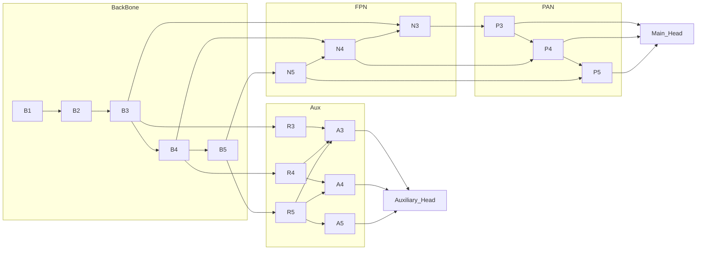

# Object Detection

## YOLOv7

| Model | State | Test Size | $AP^{val}$ | $AP_{50}^{val}$ | $AP_{75}^{val}$ | Param. | FLOPs |
|---|---|---|---|---|---|---|---|
| [YOLOv7](https://github.com/shreyaskamathkm/yolo/releases/download/v1-trained_models/v7.pt) | 🔧 | 640 | **51.4%** | **69.7%** | **55.9%** | — | — |
| YOLOv7-X | 🔧 | 640 | **53.1%** | **71.2%** | **57.8%** | — | — |
| YOLOv7-W6 | 🔧 | 1280 | **54.9%** | **72.6%** | **60.1%** | — | — |
| YOLOv7-E6 | 🔧 | 1280 | **56.0%** | **73.5%** | **61.2%** | — | — |
| YOLOv7-D6 | 🔧 | 1280 | **56.6%** | **74.0%** | **61.8%** | — | — |
| YOLOv7-E6E | 🔧 | 1280 | **56.8%** | **74.4%** | **62.1%** | — | — |

## YOLOv9

The trained models were utilized from the original repository [Link](https://github.com/MultimediaTechLab/YOLO/releases)
| Model | State | Test Size | $AP^{val}$ | $AP_{50}^{val}$ | $AP_{75}^{val}$ | Param. | FLOPs |
|---|---|---|---|---|---|---|---|
| [YOLOv9-T](https://github.com/shreyaskamathkm/yolo/releases/download/v1-trained_models/v9-t.pt) | 🔧 | 640 | — | — | — | — | — |
| [YOLOv9-S](https://github.com/shreyaskamathkm/yolo/releases/download/v1-trained_models/v9-s.pt) | ✅ | 640 | **46.8%** | **63.4%** | **50.7%** | **7.1M** | **26.4G** |
| [YOLOv9-M](https://github.com/shreyaskamathkm/yolo/releases/download/v1-trained_models/v9-m.pt) | ✅ | 640 | **51.4%** | **68.1%** | **56.1%** | **20.0M** | **76.3G** |
| [YOLOv9-C](https://github.com/shreyaskamathkm/yolo/releases/download/v1-trained_models/v9-c.pt) | ✅ | 640 | **53.0%** | **70.2%** | **57.8%** | **25.3M** | **102.1G** |
| [YOLOv9-E]() | 🔧 | 640 | **55.6%** | **72.8%** | **60.6%** | **57.3M** | **189.0G** |

## Architecture

