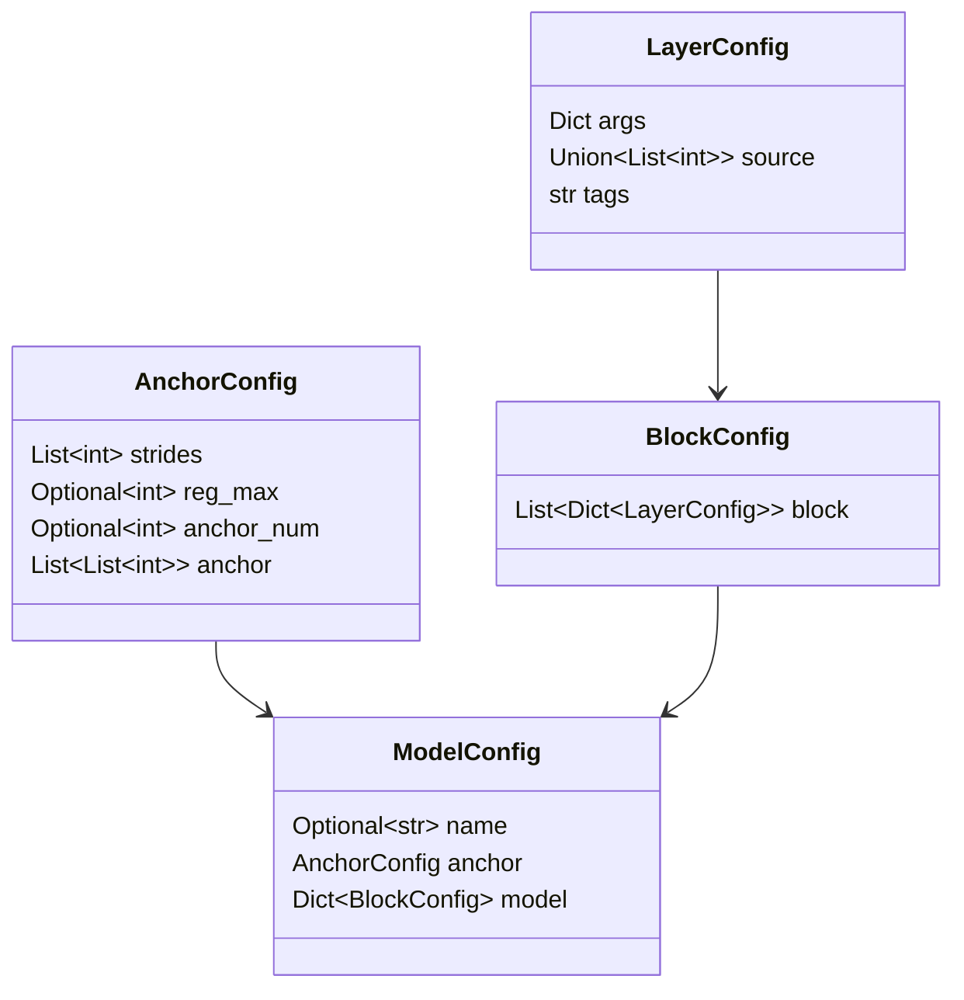
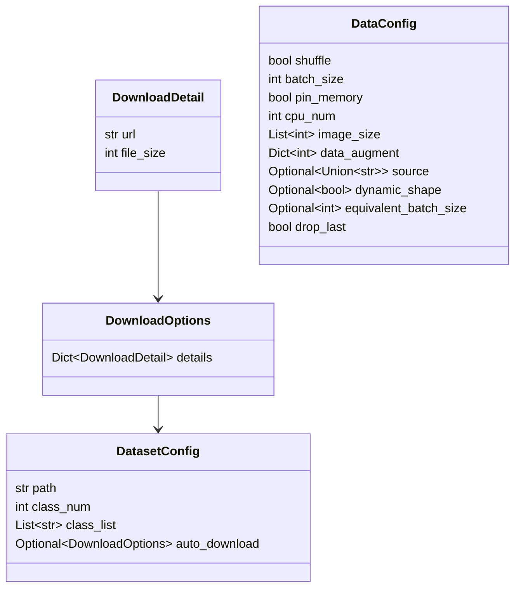
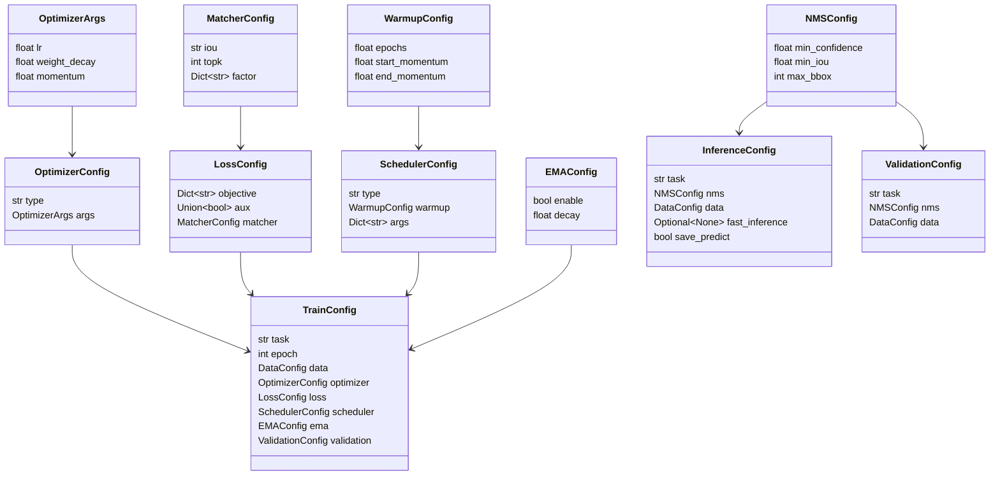
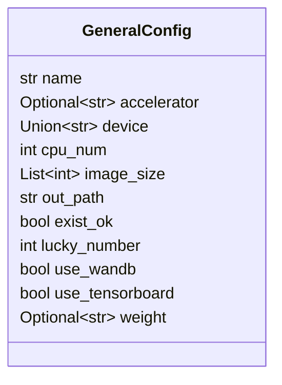
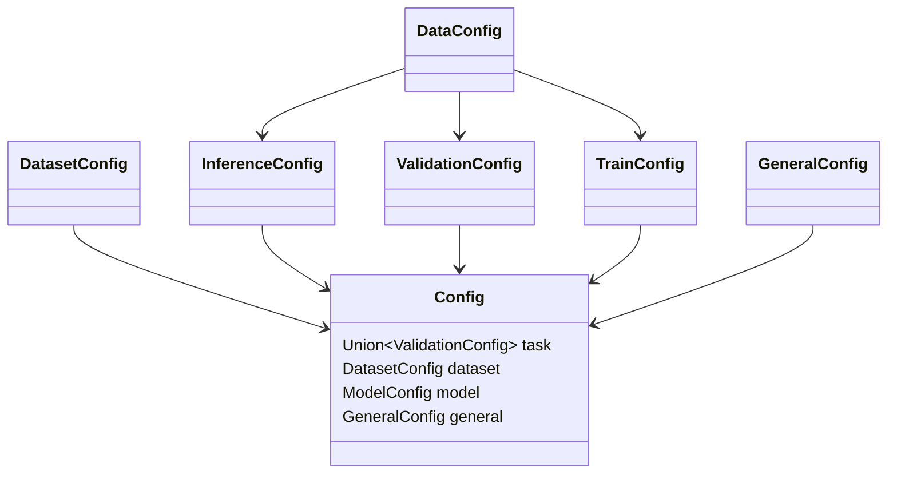

# Config

::: yolo.config.config.Config
    options:
      members: true
      undoc-members: true

::: yolo.config.config
    options:
      members: true
      undoc-members: true

## Schema

### Model Config

### Dataset Config

### Train Config

### General Config

### Top-level Config

