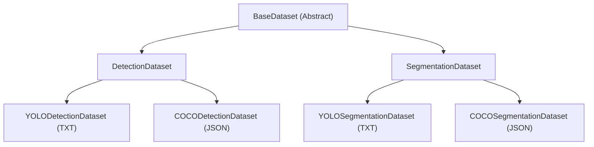

# Dataset Architecture

The `yolo` repository uses a modular, inheritance-based architecture for data loading to support multiple tasks (Detection, Segmentation, Pose) and multiple label formats (COCO JSON, YOLO TXT) seamlessly.

## Data Structures

We use structured dataclasses to pass data through the pipeline, ensuring type safety and clarity.

- **`Sample`**: Represents a single image and its associated labels (bboxes, masks, keypoints).
- **`Batch`**: Represents a collated batch of samples. Data is accessed via attributes (e.g., `batch.images`, `batch.targets`).

## Class Hierarchy

All datasets inherit from a common base to share logic for image loading, caching, and dynamic shape management.



### 1. `BaseDataset`
Handles core infrastructure:
- Image loading and resizing.
- Thread-safe caching of labels.
- Dynamic image size management (for multi-scale training).
- Integration with `AugmentationComposer`.
- Provides `get_more_data(n)` standard interface to fetch additional samples for multi-image transforms (like `Mosaic` and `MixUp`).

### 2. Task-Specific Datasets (`DetectionDataset`, `SegmentationDataset`)
Define how labels are structured for a particular computer vision task:
- `DetectionDataset`: Returns `[class, x1, y1, x2, y2]` boxes.
- `SegmentationDataset`: Returns both boxes and masks (polygons).

### 3. Format-Specific Datasets (`COCO...`, `YOLO...`)
Implement the actual parsing of label files:
- **COCO**: Parses JSON annotations using an internal index.
- **YOLO**: Parses `.txt` files where each line follows the task-specific YOLO format.

## Usage

You should rarely need to instantiate these classes directly. Instead, use the `create_dataloader` factory with the appropriate `TrainerTaskType` and `DataSplitType`:

```python
from yolo.data.loader import create_dataloader
from yolo.data.schema import TrainerTaskType, DataSplitType

# For Detection Training
dataloader = create_dataloader(
    data_cfg, 
    dataset_cfg, 
    task=TrainerTaskType.DETECTION, 
    split=DataSplitType.TRAIN
)

# For Segmentation Validation
dataloader = create_dataloader(
    data_cfg, 
    dataset_cfg, 
    task=TrainerTaskType.SEGMENTATION, 
    split=DataSplitType.VAL
)

# Batch Unpacking
# The Batch object supports iteration for easy unpacking (compatible with legacy logic)
for batch in dataloader:
    batch_size, images, targets, rev_transforms, paths = batch
    # Or use attributes directly
    print(batch.images.shape)
```

## Adding a New Task

To add a new task (e.g., Pose Estimation):
1. Add a new member to `TrainerTaskType` in `yolo/data/schema.py`.
2. Create `PoseDataset(BaseDataset)` in `yolo/data/base/dataset.py`.
3. Implement `__getitem__` to return `Sample(..., keypoints=...)`.
4. Create format-specific subclasses (e.g., `COCOPoseDataset`).
5. Update the factory in `yolo/data/loader.py`.
